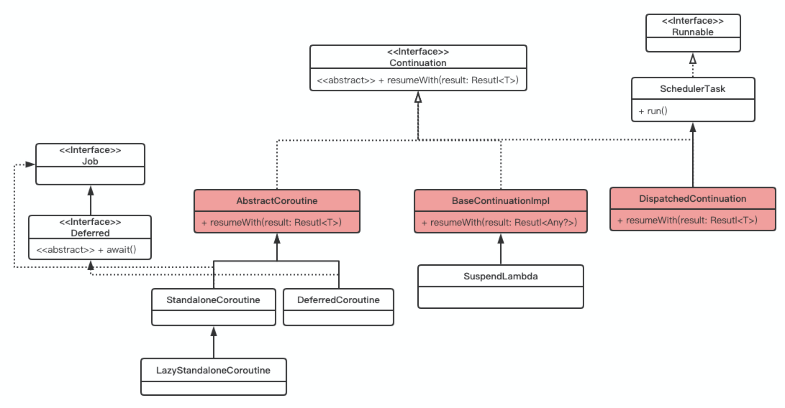
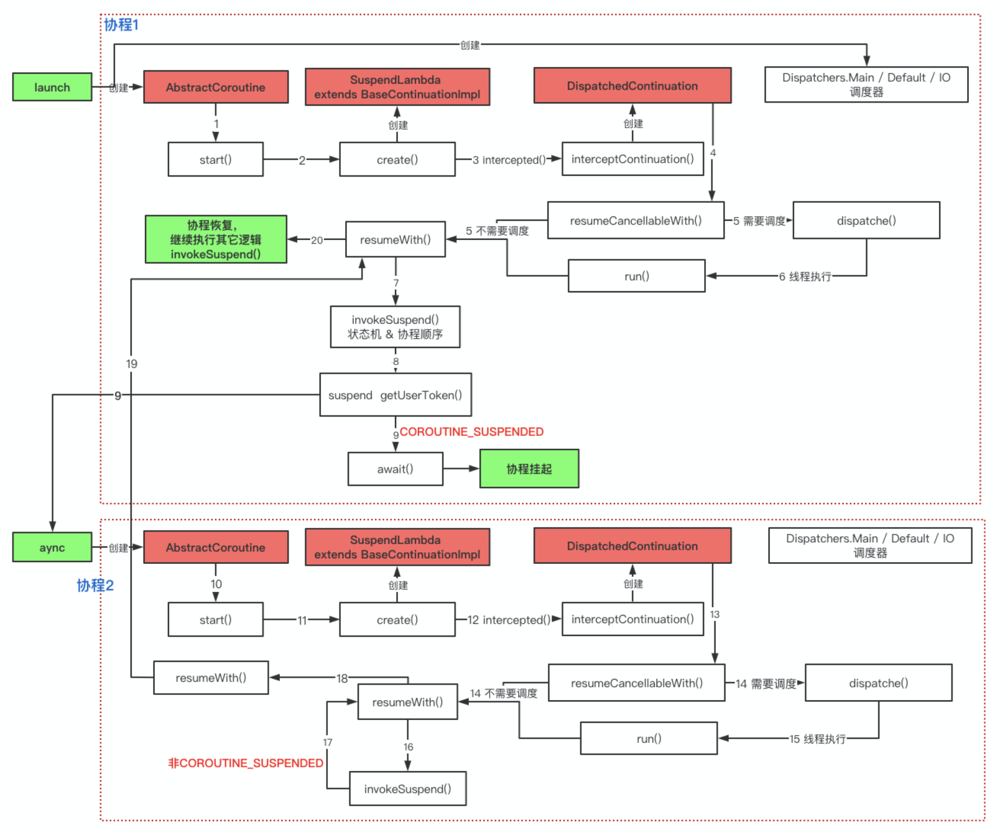

# 一、Kotlin

为什么推荐使用Kotlin进行开发？

* Koltin的优点：[https://developer.android.com/kotlin](https://developer.android.com/kotlin)
* Google在2019年I/O上宣布优先采用 Kotlin 进行 Android 开发：[https://developer.android.com/kotlin/first](https://developer.android.com/kotlin/first)

Kotlin官方文档：

[https://www.kotlincn.net/docs/reference/](https://www.kotlincn.net/docs/reference/)

[https://kotlinlang.org/docs/reference/](https://kotlinlang.org/docs/reference/)

# 二、协程

## 1、线程

线程是操作系统能够进行运算调度的最小单位。

我们在 Java 虚拟机上所认识到的线程的实现是映射到内核线程的，也就是说线程当中的代码逻辑在内核线程抢占到 CPU 的时间片时才可以执行，否则就得歇着。

**这里涉及到两个概念：**

1)、用户线程和内核线程：

[https://www.jianshu.com/p/5a4fc2729c17](https://www.jianshu.com/p/5a4fc2729c17)

[https://cloud.tencent.com/developer/article/1339562](https://cloud.tencent.com/developer/article/1339562)

2)、CPU调度

CPU调度产生线程上下文切换问题

**线程上下文切换：**

一个 CPU 在一个时刻只能运行一个线程，当其运行一个线程时，由于时间片耗尽或出现阻塞等情况，CPU 会转去执行另外一个线程，这个叫做线程上下文切换。

当前线程的任务可能并没有执行完毕，所以在进行切换时需要保存线程的运行状态，以便下次重新切换回来时，能够继续切换之前的状态运行，这个过程就要涉及到用户态和内核态的切换。

## 2、协程的定义

协程是一种非抢占式或者说协作式的计算机程序并发调度的实现，程序可以主动挂起或者恢复执行，挂起和恢复是开发者的程序逻辑自己控制的，协程是通过**主动挂起出让运行权**来实现协作。

**协程与线程的区别**：

1)、协程是编程语言级别实现的，线程是系统级的。协程是组织好的代码流程, 需要线程来承载运行。

2)、线程一旦开始执行，从任务的角度来看，就不会被暂停，直到任务结束这个过程都是连续的，线程之间是抢占式的调度，因此也不存在协作。

3)、调度：线程是在系统内核中进行，协程调度是程序定义的，在用户空间进行。

**为什么网上都说协程是轻量级的线程？**

协程更轻量的意思是，编程语言级别实现的协程就是程序内部的逻辑，不会涉及操作系统的资源之间的切换，操作系统的内核线程自然会重一些；它的调度在用户态就可以搞定，任务之间的调度并非抢占式，而是协作式的。

## 3、实践是检验真理的唯一标准

### 3.1 通过例子认识协程

1、获取并展示用户名

用户登录在应用开发中可以算是一个很常见的场景，具体的逻辑是这样的，首先向第三方平台请求用户token，然后将token和自身平台上的用户账号关联起来，最后获取用户信息展示到UI界面上。

**普通实现：**

```java
// 伪代码
fun getUserName() {
  getUserToken { token ->
    getUserName(token) { userName ->
      setText(userName)
    }
  }
}
```
RXJava实现：

```plain
fun getUserNameByRX() {
  Observable.create<String> {
    it.onNext(getUserToken())
  }.map { token ->
    getUserNameByToken(token)
  }
    .subscribeOn(Schedulers.io())
    .observeOn(AndroidSchedulers.mainThread())
    .subscribe({
      binding.userName.text = it
    }, {})
}
```
**协程：**

```plain
private fun getUserNameByCoroutine() {
  GlobalScope.launch(Dispatchers.Main) {
    var token = withContext(Dispatchers.Default) { getUserToken() }
    var userName = withContext(Dispatchers.Default) { getUserNameByToken(token) }
    binding.userName.text = userName
  }
}
```
协程能够在同一个代码块中进行多次的线程切换，可以用看起来同步的方式写出异步的代码。
### 3.2 协程与线程的效率对比

[例子：](./app/src/main/java/com/kwai/coroutine/MainActivity.kt)

协程的内部实现也是线程池(线程是操作系统能够进行运算调度的最小单位)，Kotlin协程最大的价值是写起来比RxJava的线程切换还要方便，几乎就是用阻塞的写法来完成非阻塞的任务。

线程可以让我们的程序并发的跑，协程可以让并发程序跑得看起来更美好。

当然有一个场景很适合协程：

协程的优势其实更多是体现在 IO 密集型程序上。

特别是遇到多个任务需要访问公共资源时，如果每个任务都分配一个线程去处理，那么少不了就有线程会花费大量的时间在等待获取锁上，但如果我们用协程来承载任务，用极少量的线程来承载协程，那么锁优化就变得简单了：协程如果无法获取到锁，那么协程挂起，对应的线程就可以让出去运行其他协程了。


接下来通过例子来分析源码：


---


## 4、协程的创建 & 启动

从最常用的launch来说明协程的创建和启动。
[例子：](./app/src/main/java/com/kwai/coroutine/Test.kt)

```plain
public fun CoroutineScope.launch(
    context: CoroutineContext = EmptyCoroutineContext,
    start: CoroutineStart = CoroutineStart.DEFAULT,
    block: suspend CoroutineScope.() -> Unit
): Job {
    val newContext = newCoroutineContext(context)
    val coroutine = if (start.isLazy)
        LazyStandaloneCoroutine(newContext, block) else
        StandaloneCoroutine(newContext, active = true)
    coroutine.start(start, coroutine, block)
    return coroutine
}
```
* context： 协程上下文，此处我们传入了 Main 用于主线程调度，先忽略这部分。
* start： 代表启动方式，默认值为立即执行。
* block：协程真正执行的代码块，即我们例子中launch{}括号中的代码块，此处为一个suspend CoroutineScope.() -> Unit函数。
### 4.1 返回值：Job & Deferred

常用的CoroutineScope.launch与CoroutineScope.async返回值为Job、Deferred

**Job:**

```java
public interface Job : CoroutineContext.Element {
  public val isActive: Boolean
  public val isCompleted: Boolean
  public val isCancelled: Boolean
  public fun start(): Boolean
  public fun cancel(cause: CancellationException? = null)
  public fun cancel(): Unit = cancel(null)
  public suspend fun join()
}
```
**Thread:**
```java
public class Thread implements Runnable {
    public final native boolean isAlive();
    public synchronized void start() { ... }
    @Deprecated
    public final void stop() { ... }
    public final void join() throws InterruptedException  { ... }
}
```
Job 与 Thread 基本上功能一致，它们都承载了一段代码逻辑（后者通过 run 方法，前者通过构造协程用到的 Lambda 或者函数），也都包含了这段代码的运行状态，提供了取消接口。**而真正调度时二者才有了本质的差异。**
**Deferred:**

```plain
public interface Deferred<out T> : Job {
  public suspend fun await(): T
}
```
### 4.2 CoroutineStart

调用流程：

* coroutine.start(start, coroutine, block) ->
* AbstractCoroutine.start() ->
* CoroutineStart.invoke()

invoke()涉及到Kotlin的操作符重载：

[https://www.jianshu.com/p/e265dbcfe009](https://www.jianshu.com/p/e265dbcfe009)

```plain
public enum class CoroutineStart {
  DEFAULT,
  LAZY,
  ATOMIC, // This is similar to [DEFAULT], but the coroutine cannot be cancelled before it starts executing.
  UNDISPATCHED;
}
```
枚举类，定义了协程的启动方式：
1. DEFAULT     立即启动
2. LAZY           之后启动
3. ATOMIC       自动运行 (试验性API)
4. UNDISPATCHED   在当前线程立即执行 (试验性API)
```plain
public operator fun <R, T> invoke(block: suspend R.() -> T, receiver: R, completion: Continuation<T>): Unit =
    when (this) {
        DEFAULT -> block.startCoroutineCancellable(receiver, completion)
        ATOMIC -> block.startCoroutine(receiver, completion)
        UNDISPATCHED -> block.startCoroutineUndispatched(receiver, completion)
        LAZY -> Unit // will start lazily
    }
```
->block.startCoroutineCancellable(receiver, completion)

```plain
 internal fun <R, T> (suspend (R) -> T).startCoroutineCancellable(
    receiver: R, completion: Continuation<T>,
    onCancellation: ((cause: Throwable) -> Unit)? = null
) =
    runSafely(completion) {
        createCoroutineUnintercepted(receiver, completion).intercepted().resumeCancellableWith(Result.success(Unit), onCancellation)
    }
```
```plain
public actual fun <R, T> (suspend R.() -> T).createCoroutineUnintercepted(
    receiver: R,
    completion: Continuation<T>
): Continuation<Unit> {
    val probeCompletion = probeCoroutineCreated(completion)
    return if (this is BaseContinuationImpl)
        create(receiver, probeCompletion)
    else {
        createCoroutineFromSuspendFunction(probeCompletion) {
            (this as Function2<R, Continuation<T>, Any?>).invoke(receiver, it)
        }
    }
}
```
block是调用launch传入的lambda表达式，反编译 & debug后，发现编译器生成的是一个继承自SuspendLambda的类的对象

SuspendLambda继承 ContinuationImpl 继承 BaseContinuationImpl

所以上面的分支走的是block.create(receiver, probeCompletion)

create方法也是编译器生成的：

```plain
@NotNull
public final Continuation create(@Nullable Object value, @NotNull Continuation completion) {
   Intrinsics.checkParameterIsNotNull(completion, "completion");
   Function2 var3 = new <anonymous constructor>(completion);
   var3.p$ = (CoroutineScope)value;
   return var3;
}
```
create方法的返回值为Continuation，实际上是创建了一个SuspendLambda对象，并将Job保存在completion中
**到这一步，协程的创建已经完成了，这里涉及到了两层包装：**

1. 常用的launch和async返回的Job、Deferred，里面封装了协程状态，提供了取消协程接口，而它们的实例都是继承自AbstractCoroutine，它是协程的第一层包装。
2. 第二层包装是编译器生成的SuspendLambda的子类，封装了协程的真正运算逻辑，继承自BaseContinuationImpl，其中completion属性就是协程的第一层包装。

intercepted():

```plain
createCoroutineUnintercepted(receiver, completion).intercepted()
public actual fun <T> Continuation<T>.intercepted(): Continuation<T> =
    (this as? ContinuationImpl)?.intercepted() ?: this
```
-> ContinuationImpl.intercepted()

```plain
public fun intercepted(): Continuation<Any?> =
    intercepted
        ?: (context[ContinuationInterceptor]?.interceptContinuation(this) ?: this)
            .also { intercepted = it }
```
context[ContinuationInterceptor]?.interceptContinuation(this)

-> ContinuationInterceptor.get()

-> CoroutineDispatcher.interceptContinuation(this)

```plain
public final override fun <T> interceptContinuation(continuation: Continuation<T>): Continuation<T> =
    DispatchedContinuation(this, continuation)
```
-> DispatchedContinuation.resumeCancellableWith()

```plain
inline fun resumeCancellableWith(
    result: Result<T>,
    noinline onCancellation: ((cause: Throwable) -> Unit)?
) {
    // 判断是否需要调度
    if (dispatcher.isDispatchNeeded(context)) {
        // 需要调度则通过dispatcher进行调度     
        dispatcher.dispatch(context, this)
    } else {
        // 不需要调度时，直接调用 SuspendLambda.resumeWith 来启动协程。
        resumeUndispatchedWith(result)
    }
}
```
3. **第三层包装是DispatchedContinuation，封装了线程调度逻辑，它的continuation属性就是第二层包装的实例。**

因这节只分析协程的创建和启动，协程的调度下一节分析，所以直接执行false逻辑，

最终会执行到第二层包装(编译器生成的SuspendLambda的子类)

continuation.resumeWith(result) -> BaseContinuationImpl.resumeWith(result)

->  invokeSuspend(param)

协程的启动是通过 BaseContinuationImpl.resumeWith()方法调用到编译器生成的子类 SuspendLambda.invokeSuspend 方法，**内部****通过状态机来控制协程顺序运行。**

## 5、协程中的状态机、挂起 & 恢复

反编译编译后生成的代码：

invokeSuspend()就是我们的协程中的代码，只不过按照遇到的挂起函数把代码分成了多段。

```plain
public final void test() {
 BuildersKt.launch$default((CoroutineScope)GlobalScope.INSTANCE, (CoroutineContext)Dispatchers.getMain(), (CoroutineStart)null, (Function2)(new Function2((Continuation)null) {
      int label;
      @Nullable
      public final Object invokeSuspend(@NotNull Object $result) {
         Object var10000;
         label17: {
            Object var5 = IntrinsicsKt.getCOROUTINE_SUSPENDED();
            switch(this.label) {
            case 0:
               // label + 1
               this.label = 1;
               // 调用getUserToken()，
               var10000 = var6.getUserToken(this);
               // 如果返回COROUTINE_SUSPENDE，
               if (var10000 == var5) {
                  return var5;
               }
               break;
            case 1:
               break;
            case 2:
               break label17;
            }
            this.label = 2;
            var10000 = var6.getUserNameByToken(token, this);
            if (var10000 == var5) {
               return var5;
            }
         }
         String userName = (String)var10000;
         MainActivityKt.printLog("test", "launch end userName=" + userName);
         return Unit.INSTANCE;
      }
   }), 2, (Object)null);
}
```
为了方便理解，重新捋下：

```plain
this.label = 1;
if (var6.getUserToken(this) == COROUTINE_SUSPENDED) {
  return;
} else {
  break;
}
```
**协程挂起：**
当getUserToken()方法没有执行完时，将返回COROUTINE_SUSPENDED，launch协程体被主动挂起（直接return）。

**提问：**

return后整个方法就结束了，就不执行后边的代码了，那怎么办？

**协程中的状态机：**

就是编译器通过按照遇到的挂起函数把协程代码分成了多段，通过内部变量label的值来控制协程的顺序执行。

**总结：**

* 协程的挂起函数本质上就是一个回调，回调类型就是 Continuation
* 协程体的执行就是一个状态机，每一次遇到挂起函数，都是一次状态转移，label 不断的自增来实现状态流转

**提问：**

协程的挂起函数一定会挂起协程吗？

### 5.1 协程恢复

其实在调用getUserToken()时把当前的对象传进去了，而接收的参数类型是Continuation，那么就可以推断，在delay执行完成后会调用这个Continuation.resumeWith()来重新进入invokeSuspend()，为了下次能跳到下个case代码段，label在挂起前就加一了，所以再次进入就直接往后执行了，接着如果再遇到挂起函数，那么再进行类似的判断即可。

其实总结起来就一句话：

通过被挂起的协程对象Continuation来进行回调。

**通过wait()来看协程恢复：**

DeferredCoroutine.await()

-> awaitInternal()

```plain
internal suspend fun awaitInternal(): Any? {
    while (true) {
       if (this.state !is Incomplete) {
            // 1、已完成的话直接拆箱返回结果值
            return state.unboxState()
        }
    }
    return awaitSuspend() // 2、未完成
}
private suspend fun awaitSuspend(): Any? = 
 // 1、拿到调用await()的协程
suspendCoroutineUninterceptedOrReturn { uCont ->
    val cont = AwaitContinuation(uCont.intercepted(), this)
         cont.disposeOnCancellation(invokeOnCompletion(ResumeAwaitOnCompletion(this, cont).asHandler))
    cont.getResult()
}
```
-> ResumeAwaitOnCompletion()

```plain
private class ResumeAwaitOnCompletion<T>(
    job: JobSupport,
    private val continuation: CancellableContinuationImpl<T>
) : JobNode<JobSupport>(job) {
    override fun invoke(cause: Throwable?) {
        // handler 内部调用 continuation.resume 函数恢复协程执行
        continuation.resume(state.unboxState() as T)
    }
}
```

-> invokeOnCompletion()

```plain
public final override fun invokeOnCompletion(
        onCancelling: Boolean,
        invokeImmediately: Boolean,
        handler: CompletionHandler
    ): DisposableHandle {
        loopOnState { state ->
            when (state) {
                is Incomplete -> {
                    val node = nodeCache ?: makeNode(handler, onCancelling).also { nodeCache = it }
                                    if (!addLastAtomic(state, list, node)) return@loopOnState
                    return node
                }
                else -> { // is complete
                    if (invokeImmediately) handler.invokeIt((state as? CompletedExceptionally)?.cause)
                    return NonDisposableHandle
                }
            }
        }
    }
从 async 协程的 SuspendLambda 的子类的

completion.resumeWith(outcome)

-> AbstractCoroutine.resumeWith(result)

-> JobSupport.tryFinalizeSimpleState()

-> JobSupport.completeStateFinalization()

-> state.list?.notifyCompletion(cause)

```
-> node.invoke ()
## 6、UML图 & 时序图

复习下，Kotlin中的协程存在着三层包装：

1. **第一层包装**：launch和async返回的Job、Deferred，继承自AbstractCoroutine，里面封装了协程状态，提供了取消协程的接口。
2. **第二层包装**：编译器生成的SuspendLambda的子类，封装了协程的真正运算逻辑，继承自BaseContinuationImpl，其中completion属性就是协程的第一层包装。
3. **第三层包装**：DispatchedContinuation，封装了线程调度逻辑，它的continuation属性就是第二层包装的实例。

**关键类的UML图：**



**1、****AbstractCoroutine.resumeWith()：**

封装了协程执行完成后的恢复逻辑入口。

**2、****Bas****eContinuationImpl.resumeWith()：**

封装了协程的真正运算逻辑，以及协程执行完后的回调入口AbstractCoroutine.resumeWith()的调用。

**3、DispatchedContinuation.resumeWith():**

封装了协程的线程调度逻辑的入口。

**伪时序图：**



## 7、协程调度

```plain
 if (dispatcher.isDispatchNeeded(context)) { // 判断是否需要调度
   dispatcher.dispatch(context, this)
} else {
  ....
}
```
### 7.1 Dispatchers.Main

```plain
public actual val Main: MainCoroutineDispatcher get() = MainDispatcherLoader.dispatcher
```
->MainDispatcherLoader.dispatcher
->loadMainDispatcher()

-> AndroidDispatcherFactory.createDispatcher()

-> return HandlerContext(Looper.getMainLooper().asHandler(async = true), "Main")

Dispatchers.Main 在Android的是实现是HandlerContext，内部持有一个主线程的Handler，

```plain
internal class HandlerContext private constructor(
    private val handler: Handler,
    private val name: String?,
    private val invokeImmediately: Boolean
) : HandlerDispatcher(), Delay {
  
  override fun isDispatchNeeded(context: CoroutineContext): Boolean {
    return !invokeImmediately || Looper.myLooper() != handler.looper
  }
  override fun dispatch(context: CoroutineContext, block: Runnable) {
    handler.post(block)
  }
}
```
**Main的Dispatch很简单，就是通过主线程的Handler**
### 7.2 Dispatchers.Default

```plain
public actual val Default: CoroutineDispatcher = createDefaultDispatcher()
internal actual fun createDefaultDispatcher(): CoroutineDispatcher =
    if (useCoroutinesScheduler) DefaultScheduler else CommonPool
```
#### 7.2.1CommonPool

Kotlin中会默认使用DefaultScheduler，不过我们不妨看一下与DefaultScheduler对等的CommonPool，其代码很简单，可以迅速定位到其线程池创建方法：

```plain
private fun createPlainPool(): ExecutorService {
    val threadId = AtomicInteger()
    return Executors.newFixedThreadPool(parallelism) {
        Thread(it, "CommonPool-worker-${threadId.incrementAndGet()}").apply { isDaemon = true }
    }
}
```
使用我们非常熟悉的newFixedThreadPool静态工厂方法创建了一个线程数固定，拥有无界阻塞任务队列的Java原生线程池，Kotlin协程代码块就运行这个线程池上，并没有什么特别之处。
#### 7.2.2 DefaultScheduler

DefaultScheduler继承自ExperimentalCoroutineDispatcher

```plain
public open class ExperimentalCoroutineDispatcher(
    private val corePoolSize: Int,
    private val maxPoolSize: Int,
    private val idleWorkerKeepAliveNs: Long,
    private val schedulerName: String = "CoroutineScheduler"
) : ExecutorCoroutineDispatcher() {
    public constructor(
        corePoolSize: Int = CORE_POOL_SIZE,
        maxPoolSize: Int = MAX_POOL_SIZE,
        schedulerName: String = DEFAULT_SCHEDULER_NAME
    ) : this(corePoolSize, maxPoolSize, IDLE_WORKER_KEEP_ALIVE_NS, schedulerName)
    
  private var coroutineScheduler = createScheduler()
  
  override fun dispatch(context: CoroutineContext, block: Runnable): Unit {
  coroutineScheduler.dispatch(block)
  }
  
  private fun createScheduler() = CoroutineScheduler(corePoolSize, maxPoolSize, idleWorkerKeepAliveNs, schedulerName)
  
  // 父类方法，默认返回true
  public open fun isDispatchNeeded(context: CoroutineContext): Boolean = true
}
```
-> DefaultScheduler.dispatch()

-> CoroutineScheduler.dispatch()

```plain
fun dispatch(block: Runnable, taskContext: TaskContext = NonBlockingContext, tailDispatch: Boolean = false) {
    // 1、将Runnable封装成内部类Task
    val task = createTask(block, taskContext)
    
    // 2、将任务提交到当前线程的任务队列
    val currentWorker = currentWorker()
    val notAdded = currentWorker.submitToLocalQueue(task, tailDispatch)
    
    // 3、如果2失败，将任务提交到全局的任务队列
    if (notAdded != null) {
        if (!addToGlobalQueue(notAdded)) { // 失败抛出异常
            throw RejectedExecutionException("$schedulerName was terminated")
        }
    }
    
    // 4、创建/唤醒线程处理任务
    val skipUnpark = tailDispatch && currentWorker != null
    // Checking 'task' instead of 'notAdded' is completely okay
    if (task.mode == TASK_NON_BLOCKING) {
        if (skipUnpark) return
        signalCpuWork()
    } else {
        // Increment blocking tasks anyway
        signalBlockingWork(skipUnpark = skipUnpark)
    }
}
```
CoroutineScheduler是Kotlin自己实现的一套线程池，dispatch方法相当于ThreadPoolExecutor的execute()方法，是Kotlin对于Java线程池的优化。
**优化点在于：**

Kotlin在内部线程Worker中有一个自己的任务队列 localQueue  (没讲完)

**思考一下为什么Kotlin协程中线程池每个线程中要有一个localQueue，和Java中ThreadPoolExecutor一样只有一个线程间共享的任务阻塞队列不行么？**

两种实现都是可以的，抓到老鼠的就是好猫。只是，只有一个线程间共享的任务队列，线程间对这个队列操作而发生竞争的概率极大的增加，以Java中定制线程池常用的有界阻塞队列ArrayBlockingQueue为例，其存取方法实现如下：

```java
public void put(E e) throws InterruptedException {
    Objects.requireNonNull(e);
    final ReentrantLock lock = this.lock;
    lock.lockInterruptibly();
    try {
        while (count == items.length)
            notFull.await();
        enqueue(e);
    } finally {
        lock.unlock();
    }
}
public E poll() {
    final ReentrantLock lock = this.lock;
    lock.lock();
    try {
        return (count == 0) ? null : dequeue();
    } finally {
        lock.unlock();
    }
}
```
可以发现对该并发容器的修改第一步就是加锁操作，当竞争发生时，会对任务的存取效率产生影响，也就影响线程池的整体效率。因此，Kotlin协程中线程池为了减少此竞争产生的概率，在每个线程中设置一个localQueue。
**引发的新问题：**

可能出现任务在各localQueue添加不均匀的问题，使得某些子线程十分忙碌，另一些却无事可做，而这种现象在只有一个线程间共享的任务队列的线程池实现中是不会出现的。

**提前说答案：**

1. Worker线程会优先执行内部任务队列
2. 内部任务队列为空时，去处理全局的任务队列
3. 全局任务队列为空时，去窃取其他Worker线程中任务队列中的任务
#### 7.2.3 Worker

```plain
internal inner class Worker private constructor() : Thread() {
  val localQueue: WorkQueue = WorkQueue()
  
  override fun run() = runWorker()
  private fun runWorker() {
  while (!isTerminated && state != WorkerState.TERMINATED) {
    // 1、通过findTask获取任务
    val task = findTask(mayHaveLocalTasks)
    if (task != null) {
        // 2、执行任务
        executeTask(task)
        continue
    }
    
    tryPark() // 3、无任务时，阻塞线程
 }
}
```
->findTask(mayHaveLocalTasks)

```plain
fun findTask(scanLocalQueue: Boolean): Task? {
    if (tryAcquireCpuPermit()) return findAnyTask(scanLocalQueue)
    
    val task = if (scanLocalQueue) {
        localQueue.poll() ?: globalBlockingQueue.removeFirstOrNull()
    } else {
        globalBlockingQueue.removeFirstOrNull()
    } // 1、搜索内部任务队列，没有时搜索全局任务队列
    
    return task ?: trySteal(blockingOnly = true) // 2、内部和全局任务队列都没有时，窃取其他Worker的任务
}
private fun findAnyTask(scanLocalQueue: Boolean): Task? {
    ...
    return trySteal(blockingOnly = false)
}
// 获取其他Worker中的任务
private fun trySteal(blockingOnly: Boolean): Task? {
    val created = createdWorkers
    repeat(created) {
        // 1、遍历创建的线程Worker
        val worker = workers[currentIndex]
        if (worker !== null && worker !== this) {
            // 2、尝试将该Worker中的任务队列中的任务窃取至本队列
            val stealResult = if (blockingOnly) {
                localQueue.tryStealBlockingFrom(victim = worker.localQueue)
            } else {
                localQueue.tryStealFrom(victim = worker.localQueue)
            }
            // 3、窃取成功时，直接返回新的任务
            if (stealResult == TASK_STOLEN) {
                return localQueue.poll()
            }
        }
    }
    return null
}
```
### 7.3 Dispatchers.IO

```plain
internal object DefaultScheduler : ExperimentalCoroutineDispatcher() {
    val IO: CoroutineDispatcher = LimitingDispatcher(
        this, // 传入的时DefaultScheduler
        systemProp(IO_PARALLELISM_PROPERTY_NAME, 64.coerceAtLeast(AVAILABLE_PROCESSORS)),
        "Dispatchers.IO",
        TASK_PROBABLY_BLOCKING
    )
```
LimitingDispatcher内部的dispatch方法就直接调用了这个DefaultScheduler的dispatch方法，因此Default与IO的实现使用了相同的线程池。
Dispatchers的注释中写到，Default通常用于执行CPU密集型任务，IO通常用于执行会阻塞线程的任务，在目前Android开发使用的Kotlin协程的实现下，其实只是一种习惯，并无区别。但需要注意的是Kotlin的协程使用，是通过库的方式提供的，完全可能更换成另外的实现，因此还是遵守这种习惯比较好。

# 
# 三、未涉及的部分

1. [将 Kotlin 协程与架构组件一起使用](https://developer.android.com/topic/libraries/architecture/coroutines)
2. [协程间通信：Channel](https://www.bennyhuo.com/2019/09/16/coroutine-channel/)
3. [协程Select（场景](https://www.bennyhuo.com/2020/02/03/coroutine-select/)[，两个 API 分别从网络和本地缓存获取数据，期望哪个先返回就先用哪个做展示）](https://www.bennyhuo.com/2020/02/03/coroutine-select/)
